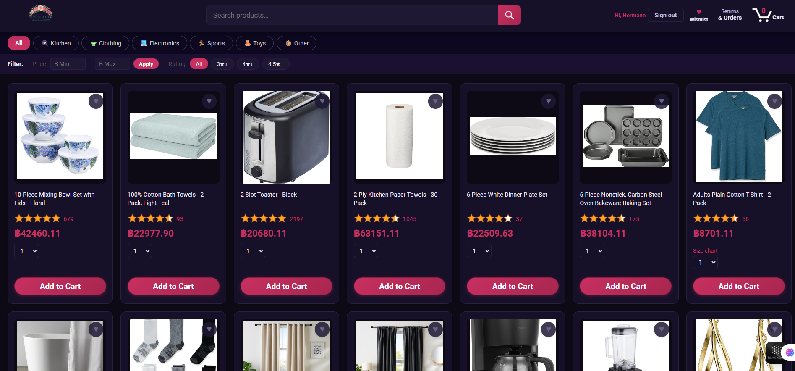
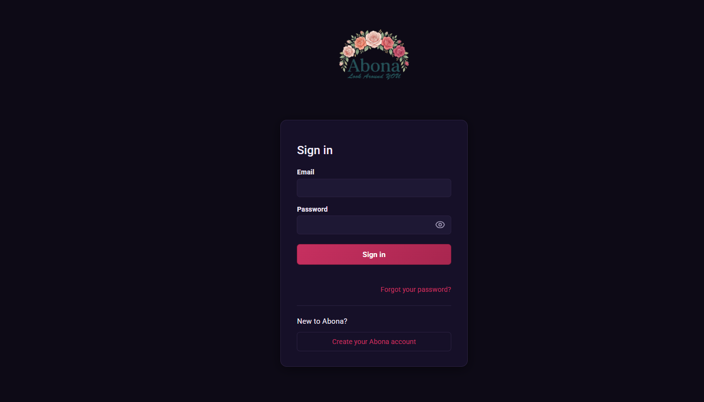
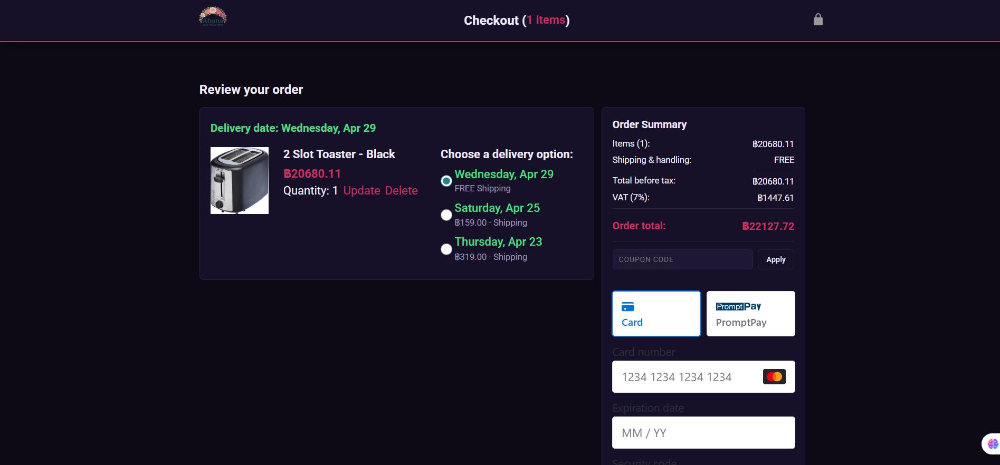
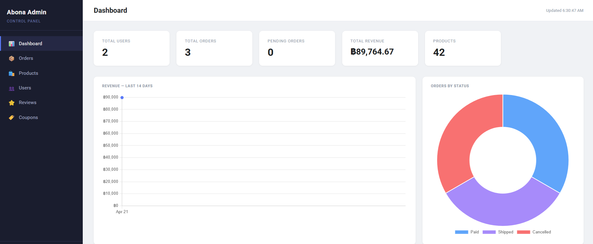
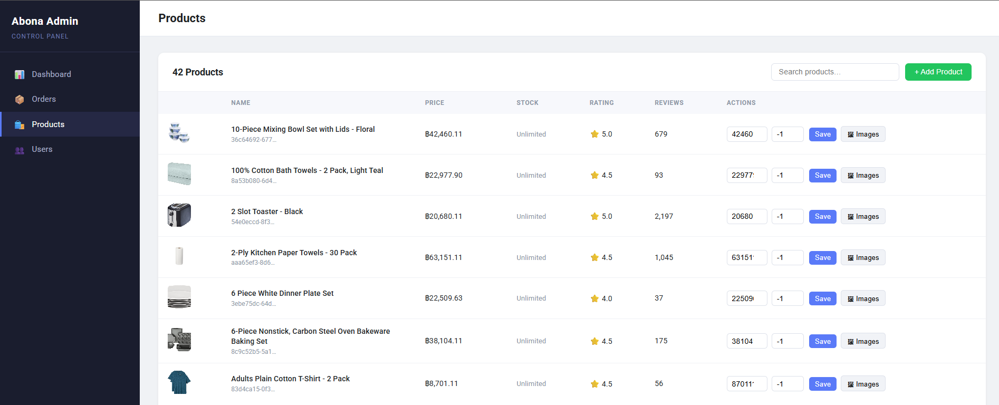

# Abona Shop 🛍️

A full-stack e-commerce web application built for the Thai market. Rose × deep plum brand identity, JWT-based authentication, Stripe payments, and a complete admin panel.

**Author:** Hermann N'zi Ngenda

**Live Site:** [https://abona-3ve.pages.dev](https://abona-3ve.pages.dev)

---

## Screenshots

### Homepage


### Login


### Checkout & Payment


### Admin Dashboard


### Admin Products


---

## Project Structure

```
Abona/
├── frontend/                   # All client-side code
│   ├── index.html              # Main shop page
│   ├── login.html
│   ├── register.html
│   ├── forgot-password.html
│   ├── reset-password.html
│   ├── checkout.html
│   ├── orders.html
│   ├── tracking.html
│   ├── product.html
│   ├── wishlist.html
│   ├── settings.html
│   ├── images/                 # Product images, logos, icons
│   ├── styles/
│   │   ├── shared/             # general.css, amazon-header.css
│   │   └── pages/              # Per-page stylesheets
│   ├── scripts/
│   │   ├── amazon.js           # Homepage product grid + filters
│   │   ├── auth.js             # Auth state, header rendering
│   │   ├── checkout.js         # Checkout page entry
│   │   ├── checkout/
│   │   │   ├── orderSummary.js
│   │   │   └── paymentSummary.js
│   │   └── utils/
│   │       ├── api.js          # API_BASE constant
│   │       ├── money.js        # formatCurrency helper
│   │       └── darkmode.js
│   └── data/
│       ├── cart.js             # Cart state + API calls
│       └── deliveryOptions.js
│
├── backend/                    # Node.js / Express API
│   ├── server.js               # App entry point
│   ├── .env                    # Environment variables (not committed)
│   ├── routes/
│   │   ├── auth.js
│   │   ├── products.js
│   │   ├── cart.js
│   │   ├── orders.js
│   │   ├── payment.js
│   │   ├── reviews.js
│   │   ├── wishlist.js
│   │   ├── coupons.js
│   │   ├── users.js
│   │   ├── uploads.js
│   │   └── admin.js
│   ├── middleware/
│   │   └── auth.js             # JWT verification middleware
│   ├── db/
│   │   ├── connection.js       # MySQL pool
│   │   ├── schema.sql          # Full database schema + triggers
│   │   └── seed.js             # Sample data seeder
│   ├── utils/
│   │   └── email.js            # Brevo HTTP API email templates
│   └── admin/                  # Admin panel HTML + assets
│
├── tests/                      # Jasmine unit tests
└── README.md
```

---

## Quick Start (Local Development)

### Prerequisites

| Tool | Version |
|------|---------|
| Node.js | 18+ |
| MySQL / MariaDB | 8.0+ (XAMPP works) |
| VS Code + Live Server | Any |

### 1 — Database

```bash
mysql -u root -p < backend/db/schema.sql
```

### 2 — Backend

```bash
cd backend
cp .env.example .env
npm install
npm start                   # http://localhost:3000
```

### 3 — Frontend

Open `frontend/index.html` with VS Code Live Server (configured via `.vscode/settings.json` to serve from `frontend/`).

Site runs at `http://127.0.0.1:5500`. Make sure `CLIENT_ORIGIN=http://127.0.0.1:5500` in `.env`.

---

## Environment Variables

```env
PORT=3000

# MySQL
DB_HOST=localhost
DB_PORT=3306
DB_USER=root
DB_PASSWORD=your_password
DB_NAME=abona_shop

# JWT
JWT_SECRET=long_random_string
JWT_ADMIN_SECRET=different_long_random_string

# Arcjet
ARCJET_KEY=ajkey_...
ARCJET_ENV=development

# CORS
CLIENT_ORIGIN=http://127.0.0.1:5500

# Stripe
STRIPE_SECRET_KEY=sk_test_...
STRIPE_PUBLISHABLE_KEY=pk_test_...

# Brevo (email)
BREVO_API_KEY=xkeysib_...
BREVO_SENDER_EMAIL=you@gmail.com
ADMIN_EMAIL=admin@yourdomain.com
```

---

## Deployment

### Overview

```
┌─────────────────────┐     HTTPS      ┌─────────────────────┐
│  Cloudflare Pages   │ ─────────────► │   Render Backend    │
│  (Frontend)         │                │   (Express API)     │
└─────────────────────┘                └──────────┬──────────┘
                                                  │ SSL
                                       ┌──────────▼──────────┐
                                       │    Aiven MySQL      │
                                       │    (Database)       │
                                       └─────────────────────┘
```

---

### Step 1 — Aiven MySQL (Database)

1. Sign up at [aiven.io](https://aiven.io) → **Create Service** → **MySQL** → Free plan
2. Once running, click your service → **Overview** tab → copy:
   - Host, Port, User, Password, Database name
3. Download the **CA Certificate** (required for SSL)
4. Upload your schema:
   ```bash
   mysql --ssl-ca=ca.pem -h your-host -P port -u user -p dbname < backend/db/schema.sql
   ```
5. Update your Render environment variables with these DB credentials (see Step 2)

---

### Step 2 — Render (Backend)

1. Push your repo to GitHub
2. Go to [render.com](https://render.com) → **New Web Service**
3. Connect your GitHub repo
4. Settings:
   - **Root directory:** `backend`
   - **Build command:** `npm install`
   - **Start command:** `node server.js`
   - **Environment:** Node
5. Add all environment variables in the Render dashboard:

```env
PORT=3000
DB_HOST=your-aiven-host
DB_PORT=your-aiven-port
DB_USER=your-aiven-user
DB_PASSWORD=your-aiven-password
DB_NAME=defaultdb
DB_SSL=true
JWT_SECRET=...
JWT_ADMIN_SECRET=...
ARCJET_KEY=...
ARCJET_ENV=production
CLIENT_ORIGIN=https://your-project.pages.dev
STRIPE_SECRET_KEY=sk_live_...
STRIPE_PUBLISHABLE_KEY=pk_live_...
BREVO_API_KEY=...
BREVO_SENDER_EMAIL=...
ADMIN_EMAIL=...
```

6. Deploy — your backend will be live at `https://abona-backend.onrender.com`

---

### Step 3 — Cloudflare Pages (Frontend)

1. Go to [pages.cloudflare.com](https://pages.cloudflare.com) → **Create a project**
2. Connect your GitHub repo
3. Settings:
   - **Root directory:** `frontend`
   - **Build command:** *(leave empty — static site)*
   - **Output directory:** `.` (dot)
4. Before deploying, update `frontend/scripts/utils/api.js`:
   ```js
   export const API_BASE = 'https://abona-backend.onrender.com';
   ```
5. Deploy — your frontend will be at `https://abona.pages.dev`
6. Go back to Render → update `CLIENT_ORIGIN=https://abona.pages.dev`

---

### Step 4 — SSL for Aiven (backend connection)

Add SSL support to `backend/db/connection.js`:

```js
ssl: process.env.DB_SSL === 'true' ? { rejectUnauthorized: true } : false
```

---

### Custom Domain (optional)

In Cloudflare Pages → **Custom Domains** → add `abona-shop.com`.
DNS is managed automatically since you're already on Cloudflare.

---

## How It Works

### Authentication Flow

```
Browser                          Backend                        Database
  │                                 │                               │
  ├─── POST /api/auth/register ────►│                               │
  │    { name, email, password }    │── bcrypt.hash(password) ─────►│
  │                                 │── INSERT INTO users ──────────►│
  │                                 │◄──────────────────────────────┤
  │◄── Set-Cookie: token (JWT) ─────┤                               │
  │                                 │                               │
  ├─── GET /api/auth/me ───────────►│── jwt.verify(cookie) ────────►│
  │◄── { user } ────────────────────┤                               │
```

- Passwords hashed with **bcryptjs** (10 rounds)
- Sessions stored as **httpOnly cookies** — XSS safe
- JWT payload: `{ id, email, name, role }`, expires 7 days
- Every protected route passes through `verifyToken` middleware

### Cart & Orders

```
Add to Cart ──► POST /api/cart
Checkout    ──► POST /api/payment/create-intent  (Stripe PaymentIntent)
            ──► stripe.confirmPayment()
            ──► POST /api/orders  (saves order, clears cart)
```

### Email Notifications

```
Event                        Customer          Admin
─────────────────────────────────────────────────────
Order placed                 ✅ Confirmation   ✅ Alert
Order paid (admin)           ✅ Notification   —
Order shipped (admin)        ✅ Notification   —
Order delivered (admin)      ✅ Notification   —
Order cancelled by customer  —                ✅ Alert
Order cancelled by admin     ✅ Notification   —
Low stock after order        —                ✅ Alert
Password reset               ✅ Reset link     —
```

### Dark Mode

```html
<script>
  if (localStorage.getItem('darkMode') === 'true')
    document.documentElement.classList.add('dark');
</script>
```

Runs before CSS loads — prevents flash of unstyled content.

---

## Database

### Schema Overview

```
users ──────────────────────────────────────────────────────────┐
  │                                                              │
  ├── sessions          (multi-device login tracking)           │
  ├── addresses         (saved shipping addresses)              │
  ├── cart_items ──────── products ──── product_images          │
  ├── wishlists                    └─── product_variants        │
  │     └── wishlist_items         └─── product_categories      │
  ├── reviews                           └── categories          │
  └── orders ─────────────────────────────────────────────────► │
        ├── order_items                                          │
        ├── order_status_logs                                    │
        └── payments                                            │
                                                                │
coupons ── coupon_uses ─────────────────────────────────────────┘
password_resets
```

### Key Tables

| Table | Purpose |
|-------|---------|
| `users` | Account data, role (user/admin) |
| `products` | Catalog with denormalised star rating |
| `product_variants` | Size/color SKUs with individual stock |
| `cart_items` | Per-user persistent cart |
| `orders` | Order header with frozen shipping snapshot |
| `order_items` | Line items with product data snapshot |
| `payments` | Stripe PaymentIntent records |
| `coupons` | Discount codes (percentage or fixed) |
| `reviews` | One review per user per product |
| `password_resets` | Secure tokens for password reset (1hr expiry) |

### Important Queries

**Fetch cart:**
```sql
SELECT c.*, p.name, p.image, p.price_cents
FROM cart_items c
JOIN products p ON c.product_id = p.id
WHERE c.user_id = ?
```

**Place an order (transaction):**
```sql
BEGIN;
  INSERT INTO orders (...) VALUES (...);
  INSERT INTO order_items (...) VALUES (...);
  UPDATE products SET stock = stock - ? WHERE id = ?;
  DELETE FROM cart_items WHERE user_id = ?;
COMMIT;
```

**Rating trigger (auto on review change):**
```sql
UPDATE products
SET stars        = (SELECT ROUND(AVG(stars), 2) FROM reviews
                    WHERE product_id = NEW.product_id AND is_approved = TRUE),
    rating_count = (SELECT COUNT(*) FROM reviews
                    WHERE product_id = NEW.product_id AND is_approved = TRUE)
WHERE id = NEW.product_id;
```

**Validate coupon:**
```sql
SELECT * FROM coupons
WHERE code = ?
  AND is_active = TRUE
  AND (expires_at IS NULL OR expires_at >= NOW())
  AND (max_uses IS NULL OR uses_count < max_uses)
```

---

## Arcjet — Security Layer

```
Incoming Request
      │
      ▼
  ┌─────────────────────────────┐
  │         Arcjet Shield        │  ← blocks bots, scrapers, attack patterns
  ├─────────────────────────────┤
  │      Sliding Window         │  ← rate limiting per IP
  │   (10 req/hr on register,   │
  │    10 req/15min on login,   │
  │    3 req/15min on reset)    │
  ├─────────────────────────────┤
  │     Email Validation        │  ← rejects disposable / invalid emails
  └─────────────────────────────┘
      │
      ▼
  Route Handler
```

---

## Stripe — Payment Flow

```
Frontend                    Backend                      Stripe
   │                           │                            │
   ├── GET /api/config ────────►│                            │
   │◄── { publishableKey } ─────┤                            │
   │                           │                            │
   ├── POST /api/payment/      │                            │
   │   create-intent ──────────►│── paymentIntents.create() ►│
   │                           │◄── { client_secret } ───────┤
   │◄── { clientSecret } ───────┤                            │
   │                           │                            │
   │  stripe.confirmPayment()  │                            │
   ├───────────────────────────┼────────────────────────────►│
   │◄── status: succeeded ──────┼────────────────────────────┤
   │                           │                            │
   ├── POST /api/orders ───────►│── saves order to DB         │
   │◄── { orderId } ────────────┤                            │
```

- Currency: **THB** (Thai Baht), amounts in satang (×100)
- Uses Stripe **Payment Element** — cards, wallets, local methods
- `return_url` handles 3D Secure redirects

---

## API Endpoints

| Method | Endpoint | Auth | Description |
|--------|----------|------|-------------|
| POST | `/api/auth/register` | ✗ | Create account |
| POST | `/api/auth/login` | ✗ | Sign in, set cookie |
| POST | `/api/auth/logout` | ✗ | Clear cookie |
| GET | `/api/auth/me` | Cookie | Get current user |
| POST | `/api/auth/forgot-password` | ✗ | Send reset email |
| POST | `/api/auth/reset-password` | ✗ | Set new password |
| GET | `/api/products` | ✗ | List all products |
| GET | `/api/products/:id` | ✗ | Single product |
| GET | `/api/cart` | ✓ | Get user cart |
| POST | `/api/cart` | ✓ | Add item |
| PATCH | `/api/cart/:id` | ✓ | Update qty / delivery |
| DELETE | `/api/cart/:id` | ✓ | Remove item |
| GET | `/api/orders` | ✓ | Order history |
| POST | `/api/orders` | ✓ | Place order |
| GET | `/api/orders/:id` | ✓ | Single order |
| PATCH | `/api/orders/:id/cancel` | ✓ | Cancel order |
| POST | `/api/payment/create-intent` | ✓ | Stripe PaymentIntent |
| GET | `/api/wishlist` | ✓ | Get wishlist |
| POST | `/api/wishlist/:id` | ✓ | Add to wishlist |
| DELETE | `/api/wishlist/:id` | ✓ | Remove from wishlist |
| POST | `/api/coupons/validate` | ✓ | Validate coupon |
| GET | `/api/reviews/:productId` | ✗ | Product reviews |
| POST | `/api/reviews/:productId` | ✓ | Submit review |

---

## Admin Panel

Local: `http://localhost:3000/admin/login`
Production: `https://abona-backend.onrender.com/admin/login`

Protected by `JWT_ADMIN_SECRET`. Features:
- Dashboard with sales overview
- Product management (add / edit / delete)
- Order management + status updates (triggers customer emails)
- Coupon creation and tracking
- User management
- Review moderation

---

## Tech Stack

| Layer | Technology |
|-------|-----------|
| Frontend | Vanilla HTML, CSS, ES Modules |
| Backend | Node.js, Express.js |
| Database | MySQL / MariaDB |
| Auth | JWT (httpOnly cookies) + bcryptjs |
| Payments | Stripe (Payment Element) |
| Security | Arcjet (shield + rate limit + email validation) |
| Email | Brevo HTTP API |
| Hosting — Frontend | Cloudflare Pages |
| Hosting — Backend | Render |
| Hosting — Database | Aiven MySQL |

---

*Built by Hermann N'zi Ngenda*
